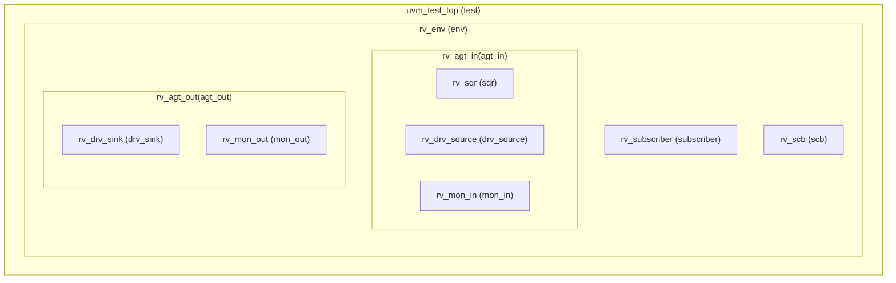
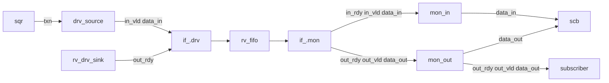
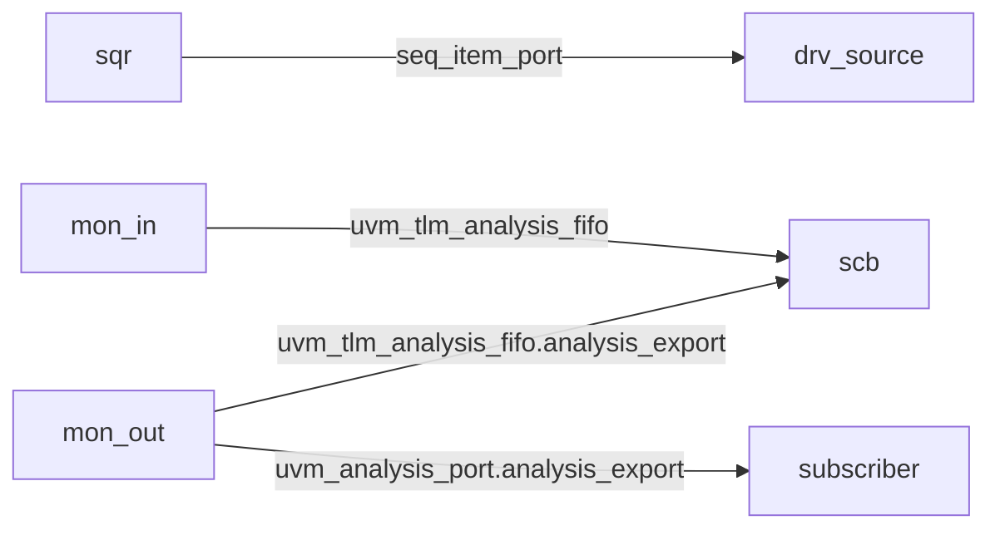

## Simulator
- Cadence Xcelium 25.03
- Options used: -access +rw -seed random -coverage functional

## Run
- ./run_xrun.sh rv_test random
- 選用 random_test (使用rv_seq, 隨機gatting 每筆資料)
- 選用 rv_d_* (direct test , 使用rv_d_seq, 每筆資料不gatting)
- scoreboard: 使用uvm_tlm_analysis_fifo 替代queue 作為reference model

## UVM 環境架構圖

## 訊號

## port connection 

