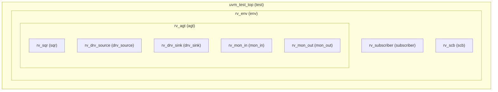
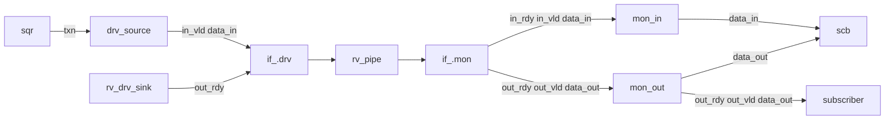
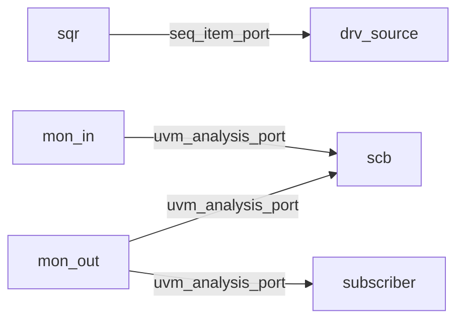
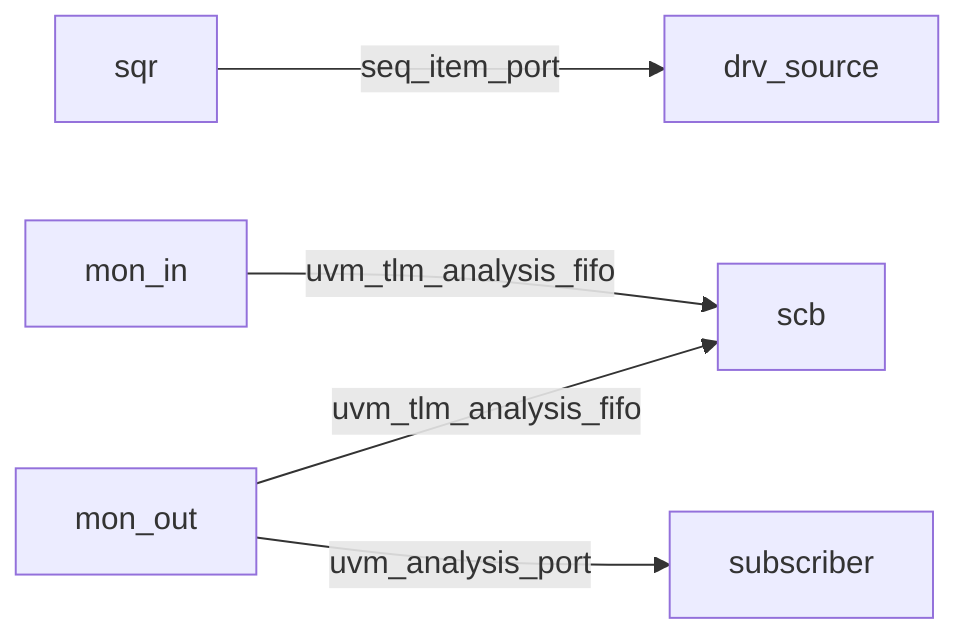

## Simulator
- Cadence Xcelium 25.03
- Options used: `-access +rw -seed random -coverage functional

## Run
- ./run_xrun.sh rv_test random
- 選用 rv_test (scb 用 兩個analysis_imp 去收data_in/out, 需定義write_in/write_out)
- 選用 rv_test_fifo (scb 用兩個uvm_tlm_analysis_fifo 去收data_in/out, 用內建write)
  - 可以將top module 中set_type_override de-command，自動替換成rv_test_fifo

## UVM 環境架構圖

## 訊號

## port connection(when xrun test.sv)

## port connection (when xrun rv_test_fifo)

