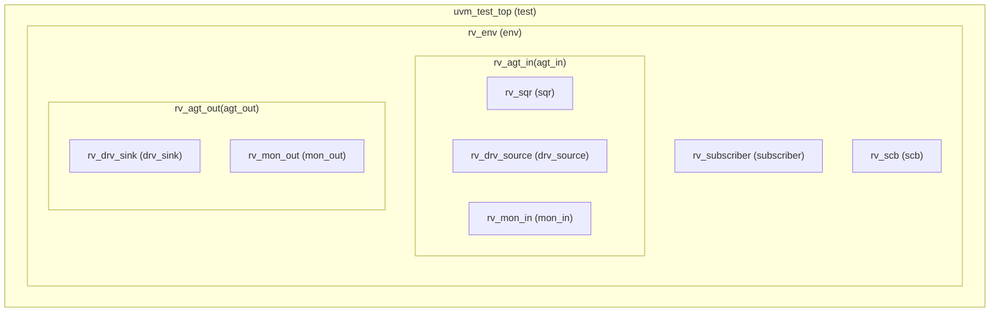
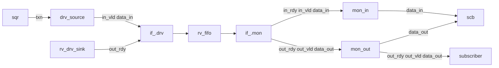
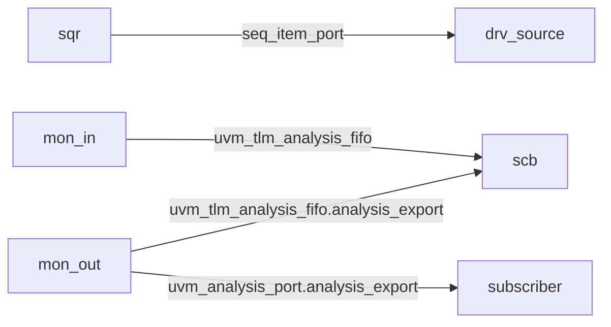

## 1. Simulator
- Cadence Xcelium 25.03
- Options used: -access +rw -seed random -coverage functional

## 2. Project Overview

This project verifies a parameterized ready/valid FIFO design using a UVM-based verification environment.
The DUT, `RV_FIFO`, implements a synchronous FIFO with ready/valid handshake on both input and output sides.  
The purpose of this project is to verify:

- FIFO ordering correctness: output data must match input data in the same order.
- Ready/valid handshake behavior under normal and backpressure conditions.
- FIFO full and empty behavior.
- Pass-through behavior when the FIFO is empty.
- input/output handshake happens at the same time when the FIFO is full.
- UVM testbench architecture using sequence, driver, monitor, scoreboard, subscriber, and assertion checker.

The scoreboard uses `uvm_tlm_analysis_fifo` as the reference comparison path.  
Input monitor sends accepted input data to the scoreboard, and output monitor sends accepted output data to the scoreboard.  
The scoreboard compares input and output data in FIFO order.

## 3. RTL Model and Pins Definition
### 3-1. Pins (dut/interface)
```systemverilog
module RV_FIFO #(
  parameter data_w = 8,
  parameter depth  = 8
)(
  RV_IF.dut if_
);
```


### 3-2. Model Behavior
- When FIFO is not full, it can accept input data.
- When FIFO is not empty, output data is valid.
- When input side is valid and output side is ready
  - When FIFO is full, the FIFO can pop one entry and accept a new input in the same cycle.
  - When FIFO is empty, the design supports pass-through style behavior (input data bypass to output).
## 4. Test Sequence and Test Case
### 4.1 Sequence Item for Input
```systemverilog
  class rv_txn extends uvm_sequence_item;
  rand int unsigned gap;
  rand int unsigned data;

  constraint c_gap {
    gap inside {[0:5]};
  }
  endclass
```
### 4.2 Randonm Sequence
- Class name `rv_seq`
- Purpose
  - Verify FIFO behavior under random input gap and random sink backpressure.
- Behavior
  - Randomizes n_times in range 1 to 10.
  - Generates randomized rv_txn items.
  - Each item has randomized data and randomized gap
  - Used by test `case rv_random_test`
### 4.3 Direct Sequence
- class name `rv_d_seq`
- Purpose
  - Easier waveform debug because expected data sequence is deterministic.
- Behavior
  - Test controls n_times..
  - If deterministic == 1, data pattern is 1, 2, 3, ... n.
  - If deterministic == 0, transaction data and gap are randomized
  - Used by test case `rv_d_test_full_to_empty`
### 4.4 Random Test


- Class name `rv_random_test`
- Configuration
  - sink_mode = SINK_RANDOM;
  - seq = rv_seq;
- Behavior:
  - Randomizes sequence length.
  - Sends random transactions from source side.
  - Sink driver randomly toggles out_rdy.
  - Scoreboard checks that output data matches input data in FIFO order.
  - Test ends when scoreboard receives the expected number of output transactions.
- Verification target
  - Normal FIFO ordering.
  - Random input gap.
  - Random output backpressure.
  - Ready/valid interaction under random traffic. 
### 4.5 Direct Test


- Class name `rv_d_test_full_to_empty`
- Configuration
  - seq = rv_d_seq;
  - seq.n_times = DEPTH;
  - seq.deterministic = 1;
    1. Set sink_mode = SINK_ALWAYS_STALL by `UVM_CONFIG_DB`.
    2. Source sends DEPTH transactions with deterministic data pattern.
    3. Waits until vif.full is asserted..
    4. Set sink_mode = SINK_ALWAYS_READY by `UVM_CONFIG_DB`
    5. Waits until vif.empty is asserted.
- Behavior:
  - FIFO from initial state to full then to empty.
- Verification target
  - FIFO full condition.
  - FIFO empty condition after draining.
  - Backpressure handling when sink stalls for a long time.
## 5. UVM enviroment



```mermaid
flowchart TD
  subgraph uvm_test_top["uvm_test_top (test)"]
    subgraph rv_env["rv_env (env)"]
      subgraph rv_agt_in["rv_agt_in(agt_in)"]
        rv_sqr["rv_sqr (sqr)"]
        rv_drv_source["rv_drv_source (drv_source)"]
        rv_mon_in["rv_mon_in (mon_in)"]
      end
      subgraph rv_agt_out["rv_agt_out(agt_out)"]
        rv_drv_sink["rv_drv_sink (drv_sink)"]
        rv_mon_out["rv_mon_out (mon_out)"]
      end
      rv_subscriber["rv_subscriber (subscriber)"]
      rv_scb["rv_scb (scb)"]
    end
  end
```
## 6. Signal Path

```mermaid
flowchart LR
  %% Sequencer -> Drivers
  rv_sqr["sqr"] -->|txn| rv_drv_source["drv_source"]

  %% Drivers -> IF 
  rv_drv_source["drv_source"] -->|in_vld data_in| rv_if.drv["if_.drv"]
  rv_drv_sink   -->|out_rdy| rv_if.drv["if_.drv"]

  %% DUT block
  rv_if.drv --> RV_FIFO["rv_fifo"]
  RV_FIFO["rv_fifo"] --> rv_if.mon

  %% IF to mon
  rv_if.mon["if_.mon"]  --> |in_rdy in_vld data_in|rv_mon_in["mon_in"]
  rv_if.mon["if_.mon"]  --> |out_rdy out_vld data_out|rv_mon_out["mon_out"]

  %% MON to SCB
  rv_mon_in  -->|data_in| rv_scb["scb"]
  rv_mon_out -->|data_out| rv_scb["scb"]
  %% MON to SUBSCRIBER
  rv_mon_out  -->|out_rdy out_vld data_out| rv_subscriber["subscriber"]

```


## 7. port connection 


```mermaid
flowchart LR
rv_sqr["sqr"] --> |seq_item_port|rv_drv_source["drv_source"]
rv_mon_in["mon_in"] -->|uvm_tlm_analysis_fifo|rv_scb["scb"]
rv_mon_out["mon_out"] -->|uvm_tlm_analysis_fifo.analysis_export|rv_scb["scb"]
rv_mon_out["mon_out"] -->|uvm_analysis_port.analysis_export|rv_subscriber["subscriber"]
```

